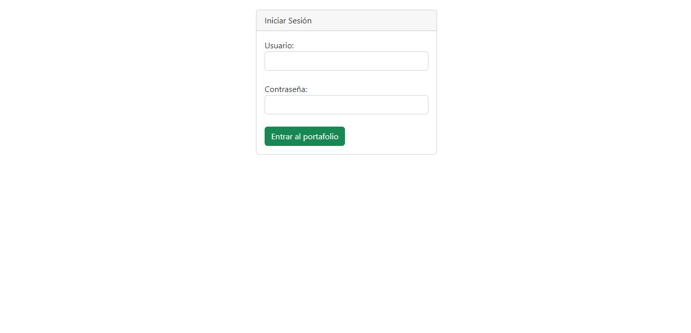
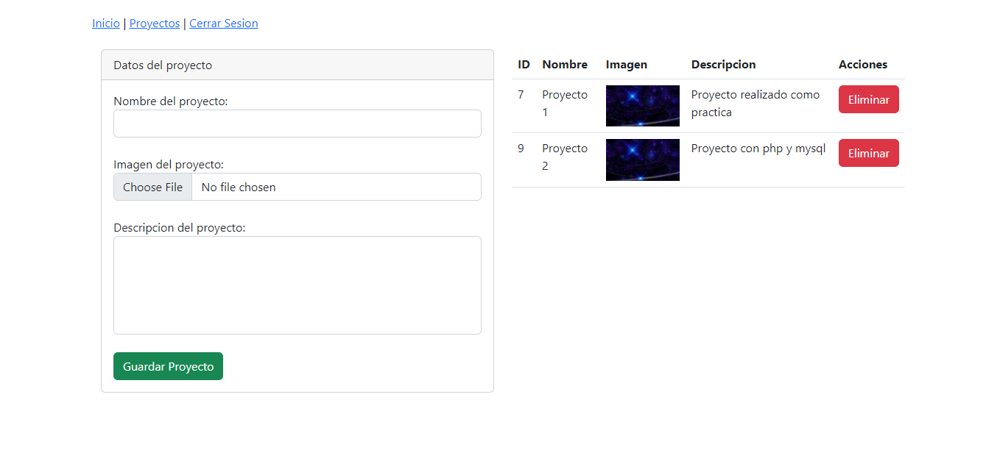

# Administrador de proyecto PHP y MySQL

Este proyecto permite administrar proyectos, es como una lista de proyectos que se han realizado, tambien se puede usar como un to-do ya que se pueden agregar proyectos y una vez terminados borrarlos. Proyecto de practica para practicar PHP. 

Se adjunta el sql de la base de datos.

## Preview Login

## Preview Index

## Preview Proyectos
